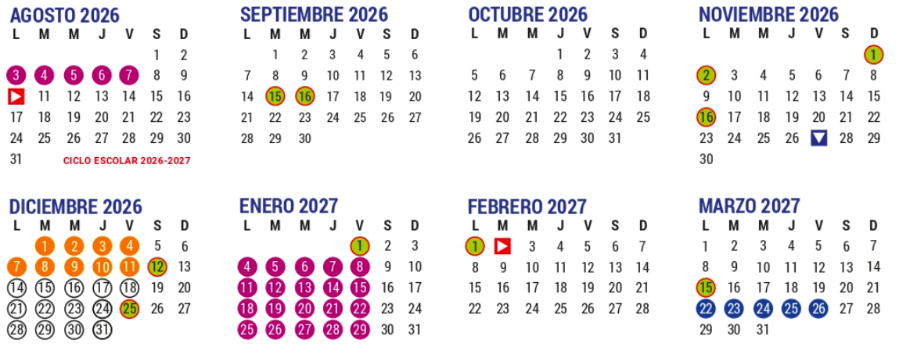

# Mercados Financieros y Valuación de Instrumentos 2027-1: Facultad de Ciencias, UNAM
## 10 de agosto al 11 de diciembre de 2026

**Profesor:** Eduardo Selim Martínez Mayorga (eduardo.selim@ciencias.unam.mx)

**Adjunto:**  (@ciencias.unam.mx)

## Horario

+ Profesor: Lunes, miércoles y viernes de 7:00 a 8:00 hrs.
+ Ayudantías: Martes y jueves 7:00 a 8:00 hrs.

# 🚀 Presentación 🚀

Esta es

La mayoría de los conceptos estudiados también se implementarán en los lenguajes de programación R (posit.co) y Python (colab.research.google.com) como calculadora, graficador, optimizador y solver.

## 🤓 Dinámica de las sesiones 🤓
Las sesiones teóricas y prácticas se llevarán a cabo de manera síncrona de 7:00 a 8:00 de la mañana presencialmente (según las indicaciones de la Universidad). Toda comunicación e intercambio de archivos se llevará a cabo a través de Google Classroom (allí se distribuirán tareas, mensajes, notas de clase, etc). También se dejarán algunas lecturas y videos para reforzar lo visto durante la clase.\\

### Requisitos sugeridos:
Cálculo Diferencial e Integral II y Álgebra Superior II.

# T E M A R I O

# 🎖 EVALUACIÓN 🎖
El curso será evaluado de la siguiente manera:

+ Laboratorios/Prácticas/Proyectos de R y Python: En equipos de a los más 4 integrantes y cuyo valor será el 20\% de la calificación final. 2 prácticas aproximadamente.
+ Cuatro exámenes parciales: De manera individual en el salón de clases, cuyo valor es del 80\% de la calificación final
+ Habrá dos reposiciones y un examen final (el mismo día).
+ La escala de calificaciones en la siguiente:
[0,6)-5, [6, 6.6)-6, [6.6, 7.6)-7, [7.6, 8,6)-8, [8.6, 9.6)-9 y [9.6, 10)-10
+ No se cambia ninguna calificación por NP. No hay renuncias a calificaciones.

# ACLARACIONES

+ Las sesiones requieren asistencia plena, no sólo física.
+ Bajo ningún motivo se aceptarán tareas después de la fecha fijada de entrega.
+ No se realizarán exámenes extemporáneos por ningún motivo.
+ No se permiten teléfonos móviles encendidos y en consecuencia, queda prohibido salir del salón para contestar llamadas. En caso de hacerlo se retirará lo que resta de dicha sesión.
+ No se permite la entrada después de la hora más 10 minutos

# FORMA DE ENTREGA DE LOS LABORATORIOS/PRACTICAS/PROYECTO:
+ Notebooks de Python y R

# CALENDARIO

## Exámenes Parciales
+ Tema 1. Viernes 11 de septiembre de 2026.
+ Tema 2. Viernes 16 de octubre de 2026.
+ Tema 3 (Tarea-Examen). Jueves 6 de noviembre de 2026.
+ Tema 4. Viernes 27 de Noviembre de 2026.

## Examen final y Reposiciones

Fecha indicada por la División de Estudios Profesionales para el segundo periodo de exámenes finales (entre el 1o. y 11 de diciembre de 2026).
